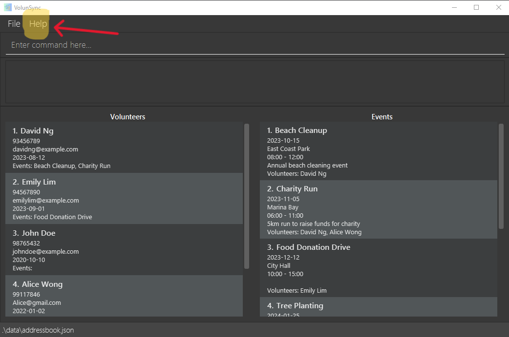
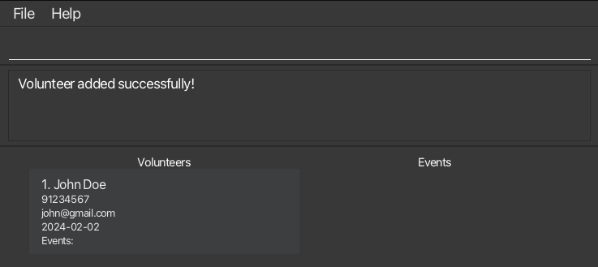
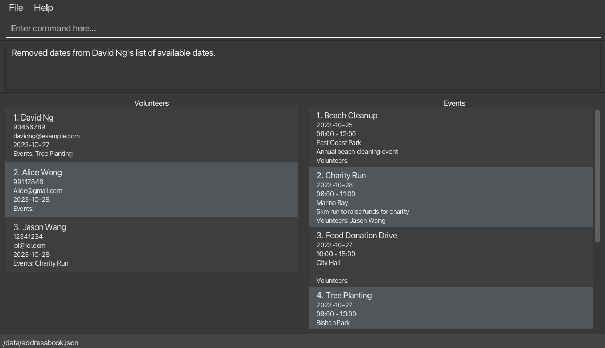
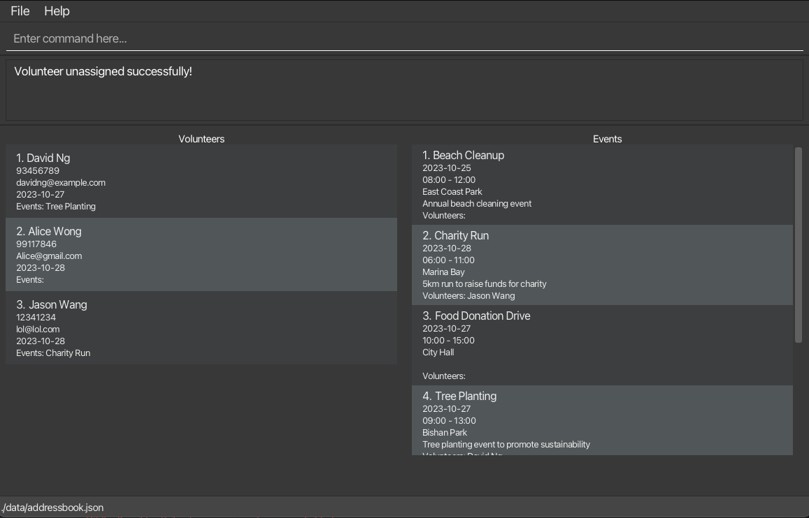
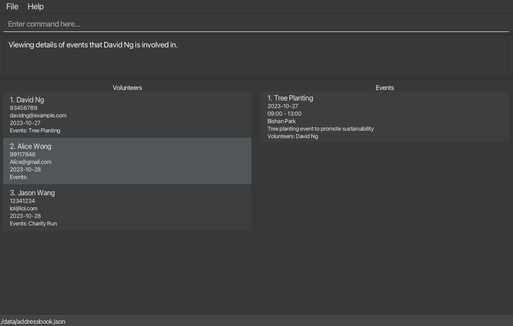
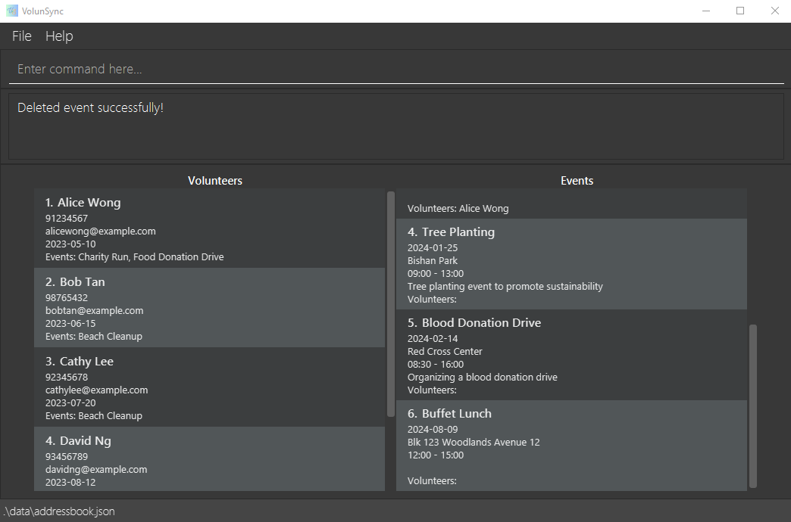

## What is VolunSync?
VolunSync is a volunteer-focused Human Resource Management System (HRMS) tailored to meet the unique needs of nonprofits. VolunSync offers a streamlined approach to managing volunteers, coordinating events, tracking hours, and enhancing communication – all from a single, intuitive platform.
## Learn About Commands Supported By VolunSync
1. [Command Format Guidelines](#command-format-guidelines)
1. [General Commands](#general-commands)
   1. [Viewing help](#viewing-help--help)
   1. [Listing all volunteers and events](#listing-all-volunteers-and-events--list)
   1. [Export database to a CSV file](#export-database-to-a-csv-file--export)
   1. [Exiting the program](#exiting-the-program--exit)
1. [Volunteer-related Commands](#volunteer-related-commands)
   1. [Adding a volunteer](#adding-a-volunteer-v-new)
   1. [Finding volunteers by name](#finding-volunteers-by-name--v-find)
   1. [Deleting a volunteer](#deleting-a-volunteer--v-del)
   1. [Adding available dates to a volunteer](#adding-available-dates-to-a-volunteer-v-free)
   1. [Removing available dates from a volunteer](#removing-available-dates-from-a-volunteer-v-unfree)
   1. [Assigning a volunteer to event](#assigning-a-volunteer-to-event-assign)
   1. [Unassigning a volunteer from an event](#unassigning-a-volunteer-from-an-event-unassign)
1. [Event-related Commands](#event-related-commands)
   1. [Adding an event](#adding-an-event-e-new)
   1. [Finding events by name](#finding-events-by-name--e-find)
   1. [Deleting an event](#deleting-an-event--e-del-)
   1. [Listing all volunteers participating in an event](#listing-all-volunteers-participating-in-an-event-e-view)
   1. [Filtering volunteers by availability for an event](#filtering-volunteers-by-availability-for-an-event-e-filter)
1. [Commands Summary](#command-summary)

## Other Resources
1. [FAQ](#faq)
1. [Known Issues](#known-issues)
1. [Saving the data](#saving-the-data)

--------------------------------------------------------------------------------------------------------------------

## Quick start


1. **Check for Java Installation**
   Ensure you have Java **17** or above installed on your computer:
   - Open a terminal or command prompt and run the following command:
     - On Windows: Press `Windows + R`, type `cmd`, and hit Enter.
     - On Mac/Linux: Open the Terminal from your Applications.
       ```bash
       java -version
       ```
   - If you see a version like `java version "17.x.x"` or higher, you're all set!
   - If Java is not installed or the version is lower than 17:
      - Download and install the latest Java Development Kit (JDK) **17** from [Oracle's official site](https://www.oracle.com/java/technologies/javase-jdk17-downloads.html) or [OpenJDK](https://openjdk.org/).
      - Follow the installation instructions provided for your operating system.
   - After installation, re-run `java -version` to confirm the setup.

1. Download the latest `.jar` file from [here](https://github.com/AY2425S1-CS2103T-W12-2/tp/releases).

1. Copy the file to the folder you want to use as the _home folder_ for your VolunSync application.

1. Open your computer's command terminal

1. In the terminal, type `cd` followed by the path to the folder with the .jar file (e.g. `C:/Users/Your_Name/Your_Folder`), then run the following command:

   `java -jar NAME_OF_JAR_FILE`. For example, `java -jar volunsync-v1.5.jar`.

1. After entering the command, the window should appear as shown below, with some sample data pre-loaded.
   

1. Type the command in the command box and press Enter to execute it. e.g. typing **`help`** and pressing Enter will open the User Guide on your browser.<br>
   Some example commands you can try:

    * `list` : Lists all volunteers and events in the VolunSync database.

    * `/v new n/John Doe p/91234567 em/john@gmail.com d/2024-02-02` : Creates a new record for a volunteer named `John Doe` to the VolunSync database.

    * `/v del 3` : Deletes the third volunteer on the list of volunteers.

    * `/e new n/Food collection l/NTUC d/2024-11-29 s/00:00 e/23:59 des/Collecting unsold food from NTUC for distribution` : Creates a new record for an event named `Food collection` to the VolunSync database.

    * `/e del 3` : Deletes the third event from the list of events.

    * `exit` : Exits the app.

1. Refer to the [Command Format](#command-format) below for details of each command.

[Back To Top :arrow_heading_up:](#learn-about-commands-supported-by-volunsync)

--------------------------------------------------------------------------------------------------------------------

## Command Format Guidelines

<div markdown="block" class="alert alert-info">

**:information_source: Notes about the command format:**<br>

* Words in `UPPER_CASE` are the parameters to be supplied by the user.<br>
  e.g. in `add n/NAME`, `NAME` is a parameter which can be used as `add n/John Doe`.

* Parameters can be in any order.<br>
  e.g. if the command specifies `n/NAME p/PHONE_NUMBER`, `p/PHONE_NUMBER n/NAME` is also acceptable.

* Items in square brackets are optional.<br>
  e.g [des/ DESCRIPTION]

* Trailing and leading whitespace is automatically trimmed in the command line input.

* For fields with character limits, internal spaces are counted as characters.
  Example:
<pre> "AB"   # 2 characters
 "A B"  # 3 characters
 "A  B" # 4 characters
</pre>

* Commands without parameters (like `help`) ignore any additional input.<br>
  e.g. if the command specifies `help 123`, it will be interpreted as `help`.

* When copying multi-line commands from this guide, make sure the spaces between lines remain intact, especially if you're using a PDF version.
</div>

[Back To Top :arrow_heading_up:](#learn-about-commands-supported-by-volunsync)

<div style="page-break-after: always;"></div>

## General Commands

### Viewing help : `help`

Opens the webpage of the User Guide in your computer's default browser from VolunSync whenever you need help.<br/><br/>
Alternatively, you can click help on the menu bar or press `F1` to open the User Guide.

Format: `help`



[Back To Top :arrow_heading_up:](#learn-about-commands-supported-by-volunsync)

<div style="page-break-after: always;"></div>

### Listing all volunteers and events : `list`

Shows a list of all volunteers and events in the database. This will reset the display to show all volunteers or events without any filters, so you can see the complete list again.<br/><br/>
You should use this command to display all volunteers and events after searching for volunteers or events using any one of the following commands: <br/>
   * [`/v find`](#finding-volunteers-by-name--v-find)
   * [`/e find`](#finding-events-by-name--e-find)
   * [`/v view`](#listing-all-events-a-volunteer-is-participating-in-v-view)
   * [`/e view`](#listing-all-volunteers-participating-in-an-event-e-view)

Format: `list`


[Back To Top :arrow_heading_up:](#learn-about-commands-supported-by-volunsync)

<div style="page-break-after: always;"></div>

### Export database to a CSV file : `export`

Exports all records within the database to a Comma Separated Value (.csv) file. This allows you to print the records or transfer the data to another computer for external use. Note that the **import function is not yet implemented**, so exported files cannot be directly re-imported into VolunSync at this time.

Format : `export`
- After running the `export` command, check the `/output` folder located in the same directory as your `.jar` file.
- You will find two CSV files:
    - `events.csv` — Contains all event records.
    - `volunteers.csv` — Contains all volunteer records.


* After running the export command, check the `/output` folder located in the same directory as your .jar file. You’ll find two CSV files: events.csv and volunteers.csv.

[Back To Top :arrow_heading_up:](#learn-about-commands-supported-by-volunsync)

### Exiting the program : `exit`

Exits the program.

Format: `exit`

[Back To Top :arrow_heading_up:](#learn-about-commands-supported-by-volunsync)

<div style="page-break-after: always;"></div>

## Volunteer-related Commands

### Adding a volunteer: `/v new`

Adds a volunteer to the database.

Format: `/v new n/NAME p/PHONE_NUMBER em/EMAIL d/AVAILABLE_DATE`

Input Requirements:
- Name: Alphanumeric and spaces only, 1-100 characters.
- Phone Number: Digits only, 3-15 characters.
- Email: Must follow local-part@domain format.
- Date: Format YYYY-MM-DD (e.g. 2024-01-01)

Examples:
* `/v new n/John Doe p/91234567 em/john@gmail.com d/2024-02-02` <br/>creates a volunteer record for `John Doe` with the specified details

Running the command successfully, you should see:



[Back To Top :arrow_heading_up:](#learn-about-commands-supported-by-volunsync)

<div style="page-break-after: always;"></div>

### Finding volunteers by name : `/v find`

Find volunteers whose name contains the given keyword.<br/>
If there are no volunteers whose names match the keyword in the database, the entire list of volunteers will be displayed.

Format: `/v find KEYWORD`

* The search is case-insensitive
* Only the name is searched
* The searching algorithm returns volunteers with any part of their name matching the `KEYWORD`
    * e.g. `Joe` will match `Joelle`, `Enjoeline` and `Joe`

<div markdown="span" class="alert alert-primary">:bulb: **Note:**
you can use <a href="#listing-all-volunteers-and-events--list">`list`</a> command to show all volunteers and events again!</div>

Examples:
* `/v find ng` returns `David Ng`, `Alice Wong` and `Jason Wang`


[Back To Top :arrow_heading_up:](#learn-about-commands-supported-by-volunsync)

### Deleting a volunteer : `/v del`

Deletes the volunteer at the specified __VOLUNTEER_INDEX__ from the database.

Format: `/v del VOLUNTEER_INDEX`

* The index refers to the number that appears before each volunteer’s name in the displayed volunteer list on the panel.
* The index **must be a positive integer** 1, 2, 3, …​

<div markdown="span" class="alert alert-primary">:bulb: **Note:**
Deleting a volunteer removes the volunteer from the list of participants of all events which the volunteer
is involved in.
</div>

Examples:
* `/v del 2` deletes the second volunteer in the displayed volunteer list.


[Back To Top :arrow_heading_up:](#learn-about-commands-supported-by-volunsync)

<div style="page-break-after: always;"></div>

### Adding available dates to a volunteer: `/v free`

Adds available dates to the volunteer with the specified `VOLUNTEER_INDEX`.

Format: `/v free i/VOLUNTEER_INDEX d/AVAILABLE_DATES`

* The index refers to the number on the left of the volunteer's name.
* The index **must be a positive integer** 1, 2, 3, …​
* Date: Format YYYY-MM-DD (e.g. 2024-01-01)
* Multiple **dates must be separated by a comma** although spacing is optional 2024-11-28, 2024-11-29, 2024-11-30, ...

Examples:
* `/v free i/1 d/2023-10-28, 2023-10-29` adds 2023-10-28 and 2023-10-29 as available dates to the first volunteer on the volunteer list.


[Back To Top :arrow_heading_up:](#learn-about-commands-supported-by-volunsync)

<div style="page-break-after: always;"></div>

### Removing available dates from a volunteer: `/v unfree`

Removes available dates from the volunteer with the specified `VOLUNTEER_INDEX`.

Format: `/v unfree i/VOLUNTEER_INDEX d/AVAILABLE_DATES`

* The index refers to the number on the left of the volunteer's name.
* The index **must be a positive integer** 1, 2, 3, …​
* Date: Format YYYY-MM-DD (e.g. 2024-01-01)
* Multiple **dates must be separated by a comma** although spacing is optional 2024-11-28, 2024-11-29, 2024-11-30, ...

Examples:
* `/v unfree i/1 d/2023-10-28, 2023-10-29` removes 2024-11-28 and 2024-11-29 as available dates from the first volunteer on the volunteer list.



[Back To Top :arrow_heading_up:](#learn-about-commands-supported-by-volunsync)

<div style="page-break-after: always;"></div>

### Assigning a volunteer to event: `assign`

Adds a volunteer with the specified `VOLUNTEER_INDEX` to the list of participants of the event with the specified `EVENT_INDEX`.

Format: `assign v/VOLUNTEER_INDEX e/EVENT_INDEX`

* The index refers to the number on the left of the event and volunteer's name in their respective displayed lists.
* The index **must be a positive integer** 1, 2, 3, …​

Examples:
* `assign v/3 e/2` assigns the third volunteer on the volunteer list to the list of participants of the second event on the event list.

<div markdown="span" class="alert alert-primary">:bulb: **Note:**
Volunteers who not available on the day of the event or are assigned to another event happening at the same time cannot be assigned.
</div>


[Back To Top :arrow_heading_up:](#learn-about-commands-supported-by-volunsync)

<div style="page-break-after: always;"></div>

### Unassigning a volunteer from an event: `unassign`

Removes a volunteer with the specified `VOLUNTEER_INDEX` to the list of participants of the event with the specified `EVENT_INDEX`.

Format: `unassign v/VOLUNTEER_INDEX e/EVENT_INDEX`

* The index refers to the number on the left of the event and volunteer's name in their respective displayed lists.
* The index **must be a positive integer** 1, 2, 3, …​

Examples:
* `unassign v/2 e/2` removes the second volunteer on the volunteer list from the list of participants of the second event on the event list.



[Back To Top :arrow_heading_up:](#learn-about-commands-supported-by-volunsync)

<div style="page-break-after: always;"></div>

### Listing all events a volunteer is participating in: `/v view`

Displays all events the volunteer at the specified `INDEX` under the `Volunteers` display is participating in.<br/>

Format: `/v view VOLUNTEER_INDEX`

* The index refers to the number on the left of the volunteer's name in the Volunteer list.
* The index **must be a positive integer** 1, 2, 3, …​

<div markdown="span" class="alert alert-primary">:bulb: **Note:**
you can use <a href="#listing-all-volunteers-and-events--list">`list`</a> command to show all volunteers and events again!</div>

Examples:



* `/v view 1` displays the events the first volunteer is participating in.

[Back To Top :arrow_heading_up:](#learn-about-commands-supported-by-volunsync)

<div style="page-break-after: always;"></div>

## Event-related Commands

### Adding an event: `/e new`

Adds an event to the database.

Format: `/e new n/EVENT_NAME l/LOCATION d/DATE s/START_TIME e/END_TIME [des/DESCRIPTION]`

Input Requirements:
- Event Name: Alphanumeric characters and spaces only, 1-50 characters.
- Location: Alphanumeric characters and spaces only, 1-100 characters.
- Date: Format YYYY-MM-DD (e.g. 2024-01-01),
- Start Time: 24-hour format HH:mm (e.g., 12:00).
- End Time: Format HH:mm (e.g., 15:00). Start time must be before end time.
- Description: Alphanumeric characters and spaces only, maximum of 100 characters. Optional; if blank, omit the des/ prefix.

Examples:
* `/e new n/Blood Donation Drive l/Red Cross Center d/2024-02-14 s/08:30 e/16:00 des/Organizing a blood donation drive` <br/>creates an event record for Blood Donation Drive with the specified details
* `/e new n/Buffet Lunch l/Blk 123 Woodlands Avenue 12 d/2024-08-09 s/12:00 e/15:00` <br/>creates an event record Buffet Lunch with the specified details


[Back To Top :arrow_heading_up:](#learn-about-commands-supported-by-volunsync)

<div style="page-break-after: always;"></div>

### Finding events by name : `/e find`

Find events with names containing the given keyword.<br>
If there are no volunteers whose names match the keyword in the database, the entire list of volunteers will be displayed.

Format: `/e find KEYWORD`

* The search is case-insensitive.
* Only the name is searched.
* The searching algorithm returns events with any part of their name matching the `KEYWORD`
    * e.g. `Group` will match `Group Project`, `Grouping Task` and `Group`.

<div markdown="span" class="alert alert-primary">:bulb: **Note:**
you can use <a href="#listing-all-volunteers-and-events--list">`list`</a> command to show all volunteers and events again!</div>

Examples:
* `/v find beach` returns `Beach Cleanup` and `beach clean2`


[Back To Top :arrow_heading_up:](#learn-about-commands-supported-by-volunsync)

<div style="page-break-after: always;"></div>

### Deleting an event : `/e del `

Deletes the specified event from the database.

Format: `/e del EVENT_INDEX`

* Deletes the event with the specified `EVENT_INDEX`.
* The index refers to the number before the event's name in the displayed event list.
* The index **must be a positive integer** 1, 2, 3, …​

<div markdown="span" class="alert alert-primary">:bulb: **Note:**
Deleting an event causes that event to be removed from all participants' list of events which they are involved in.
</div>

Examples:
* `/e del 2` deletes the second event in the event list.



[Back To Top :arrow_heading_up:](#learn-about-commands-supported-by-volunsync)

<div style="page-break-after: always;"></div>

### Listing all volunteers participating in an event: `/e view`

Displays all volunteers participating in the event at the specified `INDEX` under the `Volunteers` display.<br/>

Format: `/e view EVENT_INDEX`

* The index refers to the number on the left of the event's name in the Event list.
* The index **must be a positive integer** 1, 2, 3, …​

<div markdown="span" class="alert alert-primary">:bulb: **Note:**
you can use <a href="#listing-all-volunteers-and-events--list">`list`</a> command to show all volunteers and events again!</div>

Examples:
* `/e view 1` displays the volunteers participating in the first event in the event list.


[Back To Top :arrow_heading_up:](#learn-about-commands-supported-by-volunsync)

<div style="page-break-after: always;"></div>

### Filtering volunteers by availability for an event: `/e filter`

Filters the volunteer list to only shows volunteers who can be assigned to the event specified by `INDEX`.
After using this command, you should use the [`list`](#listing-all-volunteers-and-events--list) command to display all volunteers as per normal.

Format: `/e filter INDEX`

* The index refers to the number on the left of the event name.
* The index **must be a positive integer** 1, 2, 3, …​

Examples:
* `/e filter 1` returns volunteers available to be assigned to the first event on the event list.

<div markdown="span" class="alert alert-primary">:bulb: **Note:**
Volunteers who are already assigned to the specified event, not available on the day of the event or are assigned to another event happening at the same time will not be shown.
</div>


[Back To Top :arrow_heading_up:](#learn-about-commands-supported-by-volunsync)

<div style="page-break-after: always;"></div>

## Saving the data

VolunSync's data are saved in the hard disk automatically after any command that changes the data. There is no need to save manually.

--------------------------------------------------------------------------------------------------------------------

## FAQ

**Q**: Can I undo an action that I just made?<br>
**A**: Currently VolunSync does not support the `undo` function, but we are planning to implement it in the future so stay tuned for the update!

--------------------------------------------------------------------------------------------------------------------

## Known Issues

1. **Multi-Screen Setup Issue**
   **Problem:** If you move the application to a secondary screen and later switch to using only the primary screen, the GUI may open off-screen when you restart the app.
   **Solution:**
    - To fix this, locate and delete the `preferences.json` file, which stores the app's window position.
    - After deleting the file, restart the application, and the GUI will open correctly on the primary screen.

1. **Help Window Remaining Minimized**
   **Problem:** If you minimize the Help Window and run the `help` command (or use the `Help` menu or press the `F1` key), the Help Window will remain minimized instead of reopening.
   **Solution:**
    - Manually restore the Help Window from your taskbar or dock.
    - Alternatively, close the minimized window and run the `help` command again to open a new Help Window.

These known issues are actively being worked on, and we are continuously improving VolunSync to provide a better experience. Please stay tuned for future updates!

[Back To Top :arrow_heading_up:](#learn-about-commands-supported-by-volunsync)

--------------------------------------------------------------------------------------------------------------------

## Command summary

### General Commands

| Action                                                                         | Format   |
|--------------------------------------------------------------------------------|----------|
| **[List all Volunteers and Events](#listing-all-volunteers-and-events--list)** | `list`   |
| **[Export database to a CSV file](#export-database-to-a-csv-file--export)**    | `export` |
| **[View help](#viewing-help--help)**                                           | `help`   |
| **[Exit the program](#exiting-the-program--exit)**                             | `exit`   |

### Volunteer Commands

| Action                                                                                               | Format                                                   | Examples                                                      |
|------------------------------------------------------------------------------------------------------|----------------------------------------------------------|---------------------------------------------------------------|
| **[Add a volunteer](#adding-a-volunteer-v-new)**                                                     | `/v new n/NAME p/PHONE_NUMBER em/EMAIL d/AVAILABLE_DATE` | `/v new n/John Doe p/91234567 em/john@gmail.com d/2024-02-02` |
| **[Find volunteers by name](#finding-volunteers-by-name--v-find)**                                   | `/v find KEYWORD`                                        | `/v find Anne`                                                |
| **[Delete a volunteer](#deleting-a-volunteer--v-del)**                                               | `/v del VOLUNTEER_INDEX`                                 | `/v del 1`                                                    |
| **[Add available dates to a volunteer](#adding-available-dates-to-a-volunteer-v-free)**              | `/v free i/VOLUNTEER_INDEX d/AVAILABLE_DATES`            | `/v free i/1 d/2024-11-28, 2024-11-29`                        |
| **[Removing available dates from a volunteer](#removing-available-dates-from-a-volunteer-v-unfree)** | `/v unfree i/VOLUNTEER_INDEX d/AVAILABLE_DATES`          | `/v unfree i/1 d/2024-11-28, 2024-11-29`                      |
| **[Assigning a volunteer to event](#assigning-a-volunteer-to-event-assign)**                         | `assign v/VOLUNTEER_INDEX e/ EVENT_INDEX`                | `assign v/1 e/2`                                              |
| **[Unassigning a volunteer from an event](#unassigning-a-volunteer-from-an-event-unassign)**         | `unassign v/VOLUNTEER_INDEX e/ EVENT_INDEX`              | `unassign v/1 e/2`                                            |

[Back To Top :arrow_heading_up:](#learn-about-commands-supported-by-volunsync)

<div style="page-break-after: always;"></div>

### Event Commands

| Action                                                                                                               | Format                                                                                  | Examples                                                                         |
|----------------------------------------------------------------------------------------------------------------------|-----------------------------------------------------------------------------------------|----------------------------------------------------------------------------------|
| **[Adding an event](#adding-an-event-e-new)**                                                                        | `/e new n/EVENT_NAME l/LOCATION d/DATE s/START_TIME e/END_TIME [des/DESCRIPTION]`       | `/e new n/Coding Exam l/LT 28 d/2024-12-12 s/19:00 e/21:00 des/Final Exam`       |
| **[Finding events by name](#finding-events-by-name--e-find)**                                                        | `/e del EVENT_INDEX`                                                                    | `/e del 1`                                                                       |
| **[Deleting an event](#deleting-an-event--e-del-)**                                                                  | `/e find KEYWORD`                                                                       | `/e find Forest`                                                                 |
| **[Listing all volunteers participating in an event](#listing-all-volunteers-participating-in-an-event-e-view)**     | `/e view EVENT_INDEX`                                                                   | `/e view 1`                                                                      |
| **[Filtering volunteers by availability for an event](#filtering-volunteers-by-availability-for-an-event-e-filter)** | `/e filter EVENT_INDEX`                                                                 | `/e filter 1`                                                                    |

[Back To Top :arrow_heading_up:](#learn-about-commands-supported-by-volunsync)

